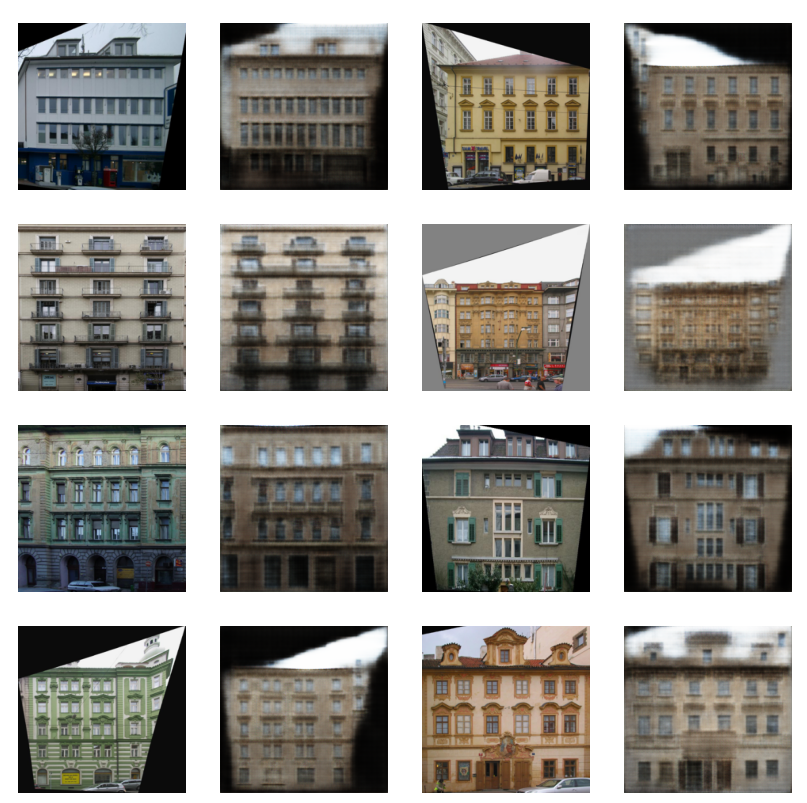
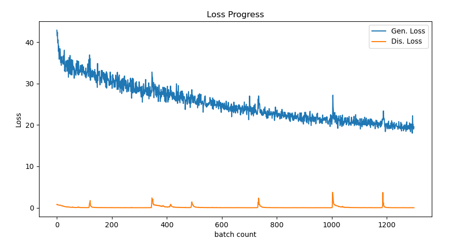

# Pix2Pix
Pix2Pix(Image-to-Image Translation with Conditional Adversarial Networks) code and description

## Paper
https://arxiv.org/pdf/1611.07004.pdf

<br/>

## Application technology
```
Python  
GAN(Generative Adversarial Nets)
U-Net
Pytorch  
```

<br/>

## Result

 
result loss

<br/>
<br/>

 
Generated image to image
